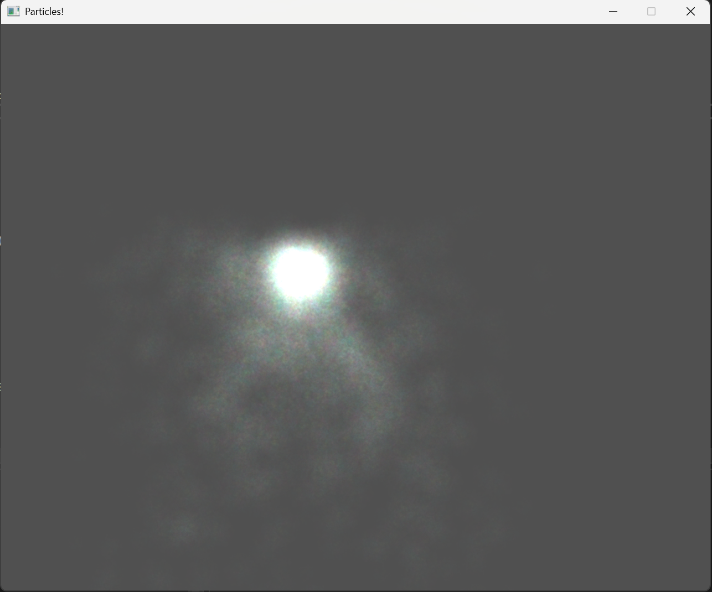

# Raylib-cs-fx
A small, optimized vfx library for developers using Raylib-cs. It includes basic stuff such as a particle system.





## Example usage 

```cs
static void Main(string[] args)
{
    const int screenWidth = 1280;
    const int screenHeight = 1024;

    InitWindow(screenWidth, screenHeight, "Particles!");

    using ParticleSystem particleSystem = new ParticleSystem(LoadTexture("Assets/cloud3.png"))
    {
        RotationPerSecond = 0f,
        ParticleLifetime = 1f, 
        AccelerationPerSecond = new Vector2(0, 900),
        VelocityJitter = (new Vector2(-500, -500), new Vector2(500, 500)),
        StartingAlpha = 0.4f,
        ParticlesPerFrame = 32,
        MaxParticles = 40_000,
        ParticleStartSize = 1f,
        ParticleEndSize = 0.5f,
        InitialRotationJitter = 360,
        SpawnPosition = GetMousePosition,
        Tint = Color.DarkPurple,
        SpawnPositionJitter = (new Vector2(-20, -20), new Vector2(20, 20)),
        TrailSegments = 20,
        TrailSegmentRenderer = new LineTrailSegmentRenderer { Color = Color.Red, Width = 2 }
    };

    particleSystem.Start();


    SetTargetFPS(60);

    while (!WindowShouldClose())
    {
             
        BeginDrawing();
        ClearBackground(Color.DarkGray);
        particleSystem.Update(GetFrameTime());
        particleSystem.Draw();
        DrawFPS(20, 20);
        EndDrawing();

    }
    CloseWindow();
}

```